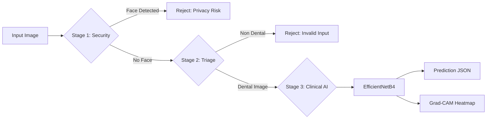

# 🦷 Healthy Smile AI Core

### Safe • Explainable • Enterprise‑Ready Dental AI


 


::: {align="center"}
``{=html}
```{=html}
<p>
```
`<i>`{=html}Clinical AI Dashboard for Dental Diagnostics`</i>`{=html}
```{=html}
</p>
```
**[🎥 Watch the 3-Minute Pitch / Demo Video Here](#)**
:::

------------------------------------------------------------------------

## 📚 Table of Contents

-   [Project Vision](#-project-vision)
-   [Key Features](#-key-features)
-   [System Architecture](#️-system-architecture)
-   [Model Performance](#-model-performance)
-   [Technology Stack](#️-technology-stack)
-   [Quick Start & Deployment](#-installation--running-the-system)
-   [REST API](#-rest-api)
-   [Future Improvements](#-future-improvements)

------------------------------------------------------------------------

## 🧠 Project Vision

**Healthy Smile AI Core** is a **production‑grade dental diagnostic
assistant** designed to safely integrate artificial intelligence into
clinical environments.

Unlike traditional deep learning classifiers that act as "black boxes,"
this system integrates:

✔ AI safety layers & Confidence Thresholds\
✔ Explainability mechanisms (XAI)\
✔ Patient Privacy protection\
✔ Human‑in‑the‑loop decision support

------------------------------------------------------------------------

## ✨ Key Features

-   🧠 **Explainable AI (Grad-CAM):** Generates heatmaps highlighting
    the exact region responsible for the diagnosis.
-   🛑 **AI Safety Guardrails:** Predictions below **80% confidence**
    are rejected and escalated to **Human Doctor Review**.
-   🛡️ **Patient Privacy Protection:** OpenCV face detection ensures
    selfies or full-face photos are rejected automatically.
-   🚦 **Smart AI Triage:** A lightweight **MobileNetV2** gatekeeper
    filters out non-dental images.

------------------------------------------------------------------------

## 🏗️ System Architecture

The project uses a strict **three‑stage AI safety pipeline**:



------------------------------------------------------------------------

## 📊 Model Performance & Analytics

The clinical model (**EfficientNetB4**) was evaluated using several
advanced metrics.

```{=html}
<table align="center">
```
```{=html}
<tr>
```
```{=html}
<td align="center">
```
`<b>`{=html}Confusion Matrix`</b>`{=html}
```{=html}
</td>
```
```{=html}
<td align="center">
```
`<b>`{=html}ROC Curves`</b>`{=html}
```{=html}
</td>
```
```{=html}
</tr>
```
```{=html}
<tr>
```
```{=html}
<td>
```
``{=html}
```{=html}
</td>
```
```{=html}
<td>
```
``{=html}
```{=html}
</td>
```
```{=html}
</tr>
```
```{=html}
<tr>
```
```{=html}
<td colspan="2" align="center">
```
`<b>`{=html}t-SNE Feature Space Visualization`</b>`{=html}
```{=html}
</td>
```
```{=html}
</tr>
```
```{=html}
<tr>
```
```{=html}
<td colspan="2" align="center">
```
``{=html} `<br>`{=html}
`<i>`{=html}Confirms the model learned real diagnostic features rather
than memorizing images.`</i>`{=html}
```{=html}
</td>
```
```{=html}
</tr>
```
```{=html}
</table>
```

------------------------------------------------------------------------

## 🧪 Sample AI Predictions

::: {align="center"}
``{=html}
:::

------------------------------------------------------------------------

## ⚙️ Technology Stack

**AI / Deep Learning** - TensorFlow - EfficientNetB4 - MobileNetV2 -
OpenCV - Grad‑CAM

**Backend** - FastAPI - Uvicorn

**Frontend** - Streamlit

**DevOps** - Docker

------------------------------------------------------------------------

## 🚀 Installation & Running the System

``` bash
# 1. Clone & Install
git clone https://github.com/your-username/healthy-smile-ai.git
cd healthy-smile-ai
pip install -r requirements.txt
```

### Run Streamlit Dashboard

``` bash
streamlit run app.py
```

### Run FastAPI Server

``` bash
uvicorn api:app --reload
```

------------------------------------------------------------------------

## 🐳 Docker Deployment

``` bash
docker build -t healthy-smile-ai .
docker run -p 8501:8501 -p 8000:8000 healthy-smile-ai
```

------------------------------------------------------------------------

## 📡 REST API

After running the backend visit:

http://127.0.0.1:8000/docs

Example request:

``` bash
curl -X POST "http://127.0.0.1:8000/analyze/" \
-H "accept: application/json" \
-H "Content-Type: multipart/form-data" \
-F "file=@patient_tooth.jpg"
```

------------------------------------------------------------------------

## 🔮 Future Improvements

-   Multi‑disease dental classification
-   Real‑time camera diagnosis
-   Electronic Health Record (EHR) integration

------------------------------------------------------------------------

## 👨‍💻 Developer & Architect

**Ahmed Ayman**\
AI & Data Science Engineer

Specializing in: - Safe AI Systems - Explainable AI - Production ML

> "Building AI that doesn't just predict --- but explains, protects, and
> scales."
